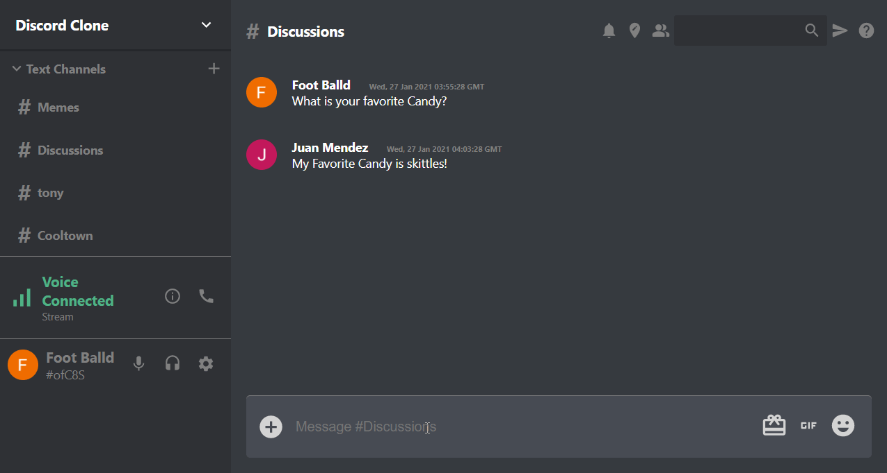

<h1 align="center">
  React JS Discord Clone 💻
</h1>
<p align="center">
A discord clone implemented using ReactJS.
[](https://github.com/juanmndz/discord-clone/blob/dev/LICENSE)


[](https://github.com/juanmndz/discord-clone/issues)
[](https://github.com/juanmndz/discord-clone/pulls)
</p>



## Features

- Login System
- LogOut System
- Add channels
- Realtime Chat
- Scroll to bottom
- Emoji Chat

## Live Demo

[Live Demo Link](https://discordapp-b6daf.web.app/)

## Built With

- ReactJs
- Redux
- MongoDB
- Express
- HTML
- CSS
- Heroku
- Material-UI

## Getting Started

To get local copy up and running in your local machine follow this simple step after cloning this repo:

### Install Dependencies

```
npm install
```
### Create Env Variables And Add For Firebase API Information

```
    REACT_APP_apiKey=""
    REACT_APP_authDomain= ""
    REACT_APP_databaseURL= ""
    REACT_APP_projectId= ""
    REACT_APP_storageBucket= ""
    REACT_APP_messagingSenderId= ""
    REACT_APP_appId= ""
```

### Run

```
npm start
```
## :handshake: Contributing

Contributions, issues, and feature requests are welcome!

Feel free to check the [issues page](https://github.com/juanmndz/discord-clone/issues).

## Show your support

Give a :star: if you like this project

## Acknowledgments
- [Material-Ui](https://material-ui.com/components/material-icons/) for its Awesome Icons
